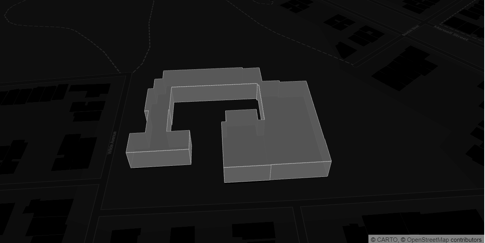
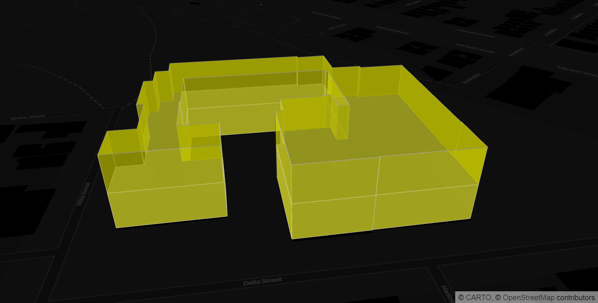

This programs the footprint of building.

The stacks that are used to develop this program are:

* python
* geopandas
* pydeck 

Make sure these language and library are installed in conda enviroment.

